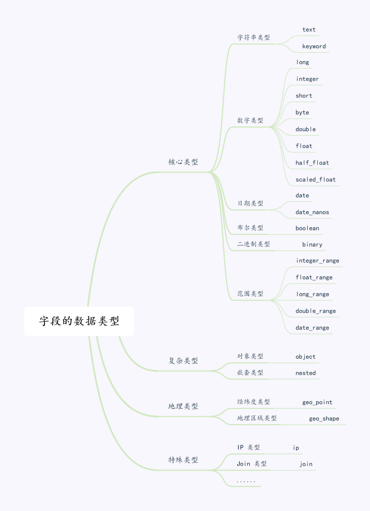

## 介绍

今天我们将使用Java来操作ElasticSearch。
我们将：

- 使用Docker搭建ES集群环境
- 使用SpringBoot搭建Java环境
- 在Java模型中定义ES的索引
- 使用两种方式来操作ES（JPA和ElasticSearchTemplate）

<!--more-->

## 搭建集群环境

今天我们继续使用docker来搭建环境。
`docker-compose.yaml`奉上。
想必大家都很清楚docker compose的用法了，这里就不再赘述。

```yaml
version: '2.2'
services:
  es01:
    image: docker.elastic.co/elasticsearch/elasticsearch:7.13.2
    container_name: es01
    environment:
      - node.name=es01
      - cluster.name=es-docker-cluster
      - discovery.seed_hosts=es02,es03
      - cluster.initial_master_nodes=es01,es02,es03
      - bootstrap.memory_lock=true
      - "ES_JAVA_OPTS=-Xms128m -Xmx128m"
    ulimits:
      memlock:
        soft: -1
        hard: -1
    volumes:
      - /Users/chengpeng/docker_volume/elasticsearch/data01:/usr/share/elasticsearch/data
    ports:
      - 9200:9200
    networks:
      - elastic
  es02:
    image: docker.elastic.co/elasticsearch/elasticsearch:7.13.2
    container_name: es02
    environment:
      - node.name=es02
      - cluster.name=es-docker-cluster
      - discovery.seed_hosts=es01,es03
      - cluster.initial_master_nodes=es01,es02,es03
      - bootstrap.memory_lock=true
      - "ES_JAVA_OPTS=-Xms128m -Xmx128m"
    ulimits:
      memlock:
        soft: -1
        hard: -1
    volumes:
      - /Users/chengpeng/docker_volume/elasticsearch/data02:/usr/share/elasticsearch/data
    networks:
      - elastic
  es03:
    image: docker.elastic.co/elasticsearch/elasticsearch:7.13.2
    container_name: es03
    environment:
      - node.name=es03
      - cluster.name=es-docker-cluster
      - discovery.seed_hosts=es01,es02
      - cluster.initial_master_nodes=es01,es02,es03
      - bootstrap.memory_lock=true
      - "ES_JAVA_OPTS=-Xms128m -Xmx128m"
    ulimits:
      memlock:
        soft: -1
        hard: -1
    volumes:
      - /Users/chengpeng/docker_volume/elasticsearch/data03:/usr/share/elasticsearch/data
    networks:
      - elastic

volumes:
  data01:
    driver: local
  data02:
    driver: local
  data03:
    driver: local

networks:
  elastic:
    driver: bridge
```

因为这里是集群，除了`volumes`需要注意之外，还需要注意`network`需要配置一下。
启动完成之后，浏览器访问:
[http://localhost:9200](http://localhost:9200)
如果展示：

表示ES集群启动成功。

## 搭建Java环境

我们创建一个SpringBoot项目。
在`pom.xml`中引入elasticsearch的starter，即可。
不过要注意的是，因为ElasticSearch版本迭代很快，我们的版本要对应的上。
我们先查看一下ElasticSearch的版本： 7.13.2
再看一下[Spring文档](https://docs.spring.io/spring-data/elasticsearch/docs/current/reference/html/)，找到对应的SpringData的版本。

在pom中我们添加上引用：
```xml
<dependency>
  <groupId>org.springframework.boot</groupId>
  <artifactId>spring-boot-starter-data-elasticsearch</artifactId>
  <version>2.6.7</version>
</dependency>
```
刷新下maven。 再继续在`application.properties`中配置:
```properties
spring.data.elasticsearch.cluster-name=es-docker-cluster
spring.data.elasticsearch.cluster-nodes=localhost:9200
```
即完成环境搭建。

## 在Java模型中定义ES的索引
好，接下来来到我们的重头戏，设计ES的索引。
在ES中，索引对应类似MySQL中的表，而Mapping，相当于MySQL中的表结构。
在一切开始之前，设计一个足够好的表结构尤为重要。可以直接影响到数据库的性能。

直接上结果：
```java
@Data
@Document(indexName = "product")
@Setting(shards = 3, replicas = 2)
public class Product {

	@Id
	@Field(type = FieldType.Text, index = false)
	private String id;

	@Field(type = FieldType.Keyword, ignoreAbove = 128)
	private String name;

	@Field(type = FieldType.Text, analyzer = "ik_smart", searchAnalyzer = "ik_smart")
	private String description;

	@Field(type = FieldType.Keyword)
	private String brandName;

	@Field(type = FieldType.Long)
	private Long stock;

	@Field(type = FieldType.Double)
	private BigDecimal price;

	@Field(type = FieldType.Date, format = {}, pattern = {"yyyy-MM-dd HH:mm:ss", "yyyy-MM-dd",
			"epoch_millis"})
	private LocalDateTime updateTime;

	@Field(type = FieldType.Nested)
	private List<Sku> skuList;
}

```

### 定义模型
我们首先定义了一个商品的Java模型`Product`，有各种Java类型（String、Long、BigDecimal、LocalDateTime、List）。
在类的上面添加`Document`注解，表示被Spring所管理。
`org.springframework.data.elasticsearch.annotations.Document`中还有一些其他的属性。大家可以参考官方文档。

### 定义Setting
定义好模型之后，我们再确定好索引的配置，`Setting`。
这里面主要配置，这个索引在ES中的分片数，和副本数。
```java
@Setting(shards = 3, replicas = 2)
```
当然，除了分片数和副本数，还有其他的配置，大家参考官方文档。

### 定义Mapping
接下来，就到了定义最重要的Mapping。

#### 确定数据结构
首先我们要知道，ES有这自己的数据结构，而且种类还很多。如图：

我们需要再每一个Java的数据结构中，对应上ES的数据结构。
比如`@Field(type = FieldType.Text)`表示它在ES中，是一个文本型的数据。
而文本型，是要被分词，生成倒排索引的。
这里提几点选择策略：
- 文本类型分两种，需要分词，选text，不需要分词，选keyword
- 如果你未来不确定你到底有多少数据，将类型设置为long是比较合适的
- keyword检索比较短的字符会更快，如果字符很大，那么会增加存储和检索成本，可以使用`ignoreAbove`属性

#### 确定是否需要被索引
默认情况下，索引的字段都是需要被索引的，但是为了节省空间，我们可以把一些字段设置成不建索引。
比如ID一类的参数，不想被索引：`@Field(type = FieldType.Text, index = false)`

#### 检索的方式
我们可以通过分词器，来定义我们的分词方式，比如
`@Field(type = FieldType.Text, analyzer = "ik_smart", searchAnalyzer = "ik_smart")`
这样，我们就可以使用中文的倒排索引啦。。。

#### 特殊的类型
如果我们需要使用时间类型，在Java中，我们使用`LocalDateTime`,对应ES中是`Date`类型。
但是需要注意的是，我们需要定义格式化的方式，不然大概率时分秒要丢失。
`@Field(type = FieldType.Date, format = {}, pattern = {"yyyy-MM-dd HH:mm:ss", "yyyy-MM-dd", "epoch_millis"})`

嵌套类型，使用`Nested`
`@Field(type = FieldType.Nested)`

## 使用两种方式来操作ES