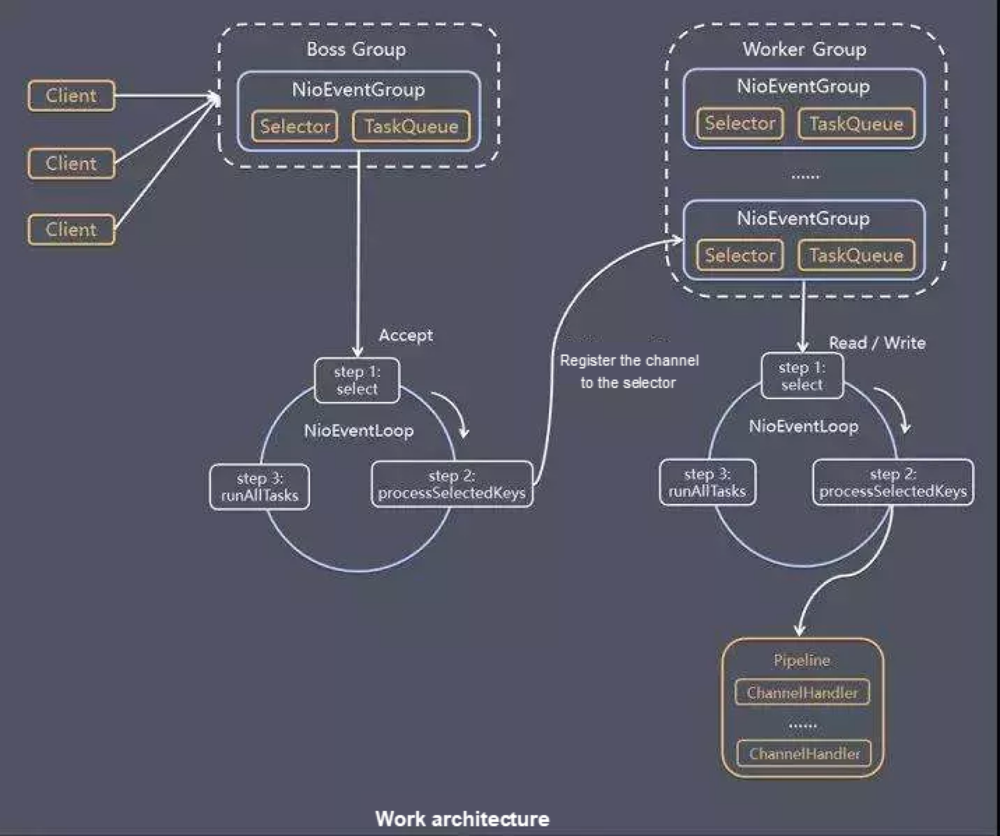
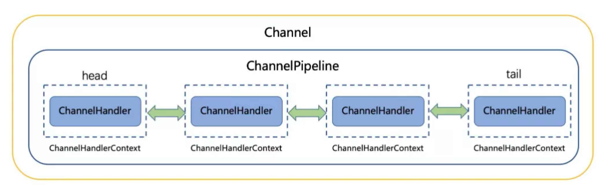

## 介绍
Netty是一套支持NIO的客户端-服务器框架。
高性能、高并发。
支持异步通信。
他是使用Java编写的。
在Java领域中，他是IO界的老大，特别是网络IO。
很多项目都用它，比如Dubbo，RocketMQ，Cassandra等等。

在这片文章中，我们会学习到：
1. 常见的IO模型
2. Netty项目
3. Netty实战
4. Netty在我司生产中的应用

那我们开始吧！

<!--more-->

## 常见的IO模型

### BIO，阻塞IO
> 排队

当一个IO请求过来，客户端进入等待，服务端处理数据，并保持阻塞（其他的客户端访问不了）。

等到服务端处理完数据，返回给等待中的客户端。

很像我们排队买鸭子的过程（没错，我在南京）。一个一个来。

他的优点是，模型很简单，容易实现，且不容易出问题。
确定也很明显，在客户多了的时候，体验会很不好。

### NIO，非阻塞IO
> 轮询

客户端在执行了IO请求之后，会立刻返回结果，要不返回结果，要不还需等待。
如果还需要等待的话，客户会发起轮询，不断的请求服务端，直到返回结果。

比如我去买一个手抓饼，我下单了之后，需要等待，并且过一段时间，我会问一下老板，
我的手抓饼好了没，如果没有，再过一段时间，再问下老板，我的手抓饼好了没。
直到老板把手抓饼给我。

他的优势是它不会再阻塞了，不用排队等在那里。我可以干一些别的事情。

缺点也是有的，我需要不断的询问，这样也很消耗性能。
而且如果我需要的结果（手抓饼）已经准备好，但是我没有及时询问，
这种情况，客户端拿到数据的时间会晚于真实的数据时间。

### IO多路复用
> 事件处理

IO多路复用，它是接受各种事件（比如连接、读取或写入、错误发生等)。
接受到各种事件消息后，记录下来，并返回一个描述符。

等到数据准备完成，再根据描述符找到是哪个客户端，并通知客户端来取数据。

打个比方，就像我们排队买奶茶，下单之后，拿到一个号码。
等到奶茶做好来之后，奶茶店会叫号，让我们去取奶茶。

它的优点是可以释放客户端，不需要阻塞。
因为仅仅是接受事件，一个线程就够了，不要很多线程来处理请求。

像Redis，Nginx都是使用的IO多路复用模型。

### AIO、异步IO模型
> 回调

这种IO模型很像JS中的AJAX，发起一个请求之后，继续往下之后后续逻辑。
等到数据返回之后，走到回调方法，并发数据结果带过来。

这种就像点外卖，下单之后，等到外卖准备好，直接把外卖送到家。

优点就是，非常高效，客户端有着最佳的性能。
缺点就是，模型结构复杂，不是所有操作系统都能支持。

## Netty项目结构

Netty是一个大而全的IO框架，它支持各种各样的协议。
对各种IO模型都有封装。
更友好的操作API。
更高效的性能。

接下来，我们自己看一下它。

### Netty IO 模型

Netty使用的是反应模型的一种，有主线程组和工作线程组。
主线程组负责处理各种连接，并分发任务给工作线程组。
工作线程组就负责处理各种输入输出请求。并执行定义好的pipeline。

### 三大核心

#### 1、ChannelBuffer 缓冲区
可以自定义的，多类型，API友好的缓冲区类型。

我们在使用IO的时候，都会使用到buffer，为解决速率不一致。
但是在操作系统层面和Java原生层面，只提供了ByteBuffer。字节缓冲区。
非常的单一，而且操作起来很不方便。

在Netty中，对缓冲区有了更好的封装。自动的装包和拆包。

而且ChannelBuffer支持zero-copy，这里的零拷贝，不是操作系统的零拷贝。
它的原理是在用户模式直接维护一个内核模式的buffer地址，直接进行操作。
不需要再进行内核模式切换，把buffer拷贝到用户模式里面来。

#### 2、通用API
对BIO和NIO的通用抽象。
支持不同的通讯协议（TCP/UDP）

如果我们使用Java原生的IO/NIO接口编写，
会相当复杂繁琐。

更糟糕的是，如果我们需要把系统从BIO升级到NIO，
基本上需要重新开发一边

而如果我们一开始使用Netty开发，
IO模型、通讯协议都可以的切换得更加顺滑

#### 3、事件模型 
> 基于拦截器链模式的事件模型

Netty使用pipeline，实现了一个结构清晰得事件模型。

每当一个Channel被创建的时候，就会同时创建一个ChannelPipeline，
并永久的绑定到这个Channel上。

一个Event事件被加入到，触发一个pipeline，其中很多的Handler执行操作。

我们还可以实现自己的Handler来处理自己的业务逻辑。
而不会破坏代码。

而对于我们开发Netty应用，我们只需要配置好Netty，
然后写好自己的业务逻辑Handler，并加入到Pipeline中。
其他的交给Netty就好了，非常的方便。

### 传输服务
> 处理基于流的传输

在基于TCP/IP的基于流的协议中，数据包都是基于字节流的。
所以在一个数据包中，可能不是一个完整的我们需要的数据包。

所以在数据包的处理上，就会有很多繁琐的工作内容。
拆包、装包

所以Netty提供了一个可以扩展的类`ByteToMessageDecoder`
里面提供很多开箱即用的编码、解码器。
初次之外，我们还可以编写自己的定制编码、解码器。

在TCP的世界中，所有的数据传输都是基于字节流的。
但是Netty提供了一种封装，
可以同时解决粘包、拆包的问题，还可以给转换成POJO对象。
这样解码器直接解出来的就是一个Java对象。更优雅。

### 协议支持

Netty实现了各种高级的传输协议。
比如：HTTP、SSL、WebSockets等等。
我们甚至可以编写自己的协议。

## Netty实战

## Netty在开放平台中的应用

## 总结

## 参考
- https://netty.io/
- http://www.kegel.com/c10k.html
- https://gee.cs.oswego.edu/dl/cpjslides/nio.pdf
- https://github.com/netty/netty
- https://github.com/netty/netty/wiki/User-guide-for-4.x
- https://netty.io/3.8/guide/#architecture
- https://www.youtube.com/watch?v=I8yy2Cy7dDI
- https://alibaba-cloud.medium.com/essential-technologies-for-java-developers-i-o-and-netty-ec765676fd21
- https://liakh-aliaksandr.medium.com/java-sockets-i-o-blocking-non-blocking-and-asynchronous-fb7f066e4ede