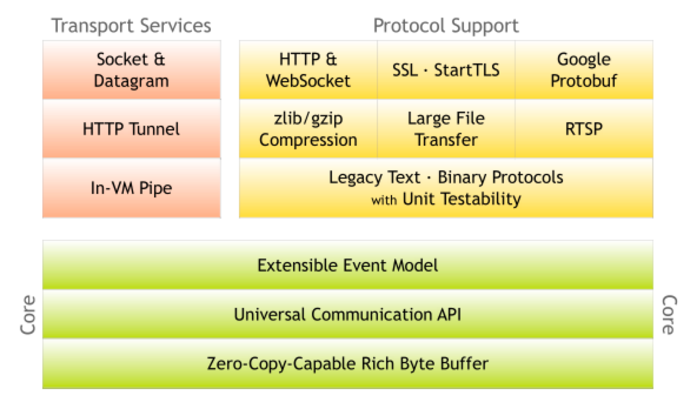
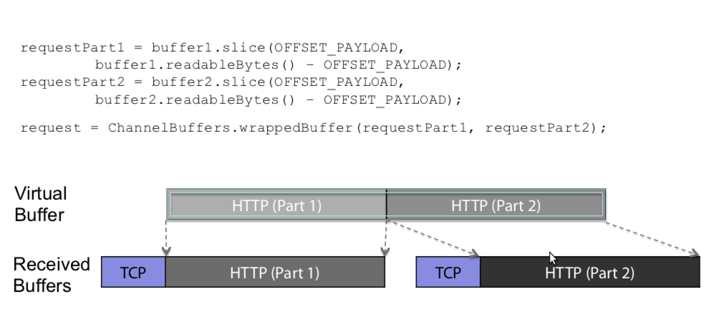

## 介绍
Netty是一套支持NIO的客户端-服务器框架。
高性能、高并发。
支持异步通信。
他是使用Java编写的。
在Java领域中，他是IO界的老大，特别是网络IO。
很多项目都用它，比如Dubbo，RocketMQ，Cassandra等等。

在这片文章中，我们会学习到：
1. 常见的IO模型
2. Netty项目
3. Netty实战
4. Netty在我司生产中的应用

那我们开始吧！

<!--more-->

## 常见的IO模型

## Netty项目结构

### 三大核心

#### 1、字节缓冲区

You can define your own buffer type if necessary.

Transparent zero copy is achieved by a built-in composite buffer type.

A dynamic buffer type is provided out-of-the-box, whose capacity is expanded on demand, just like StringBuffer.

There's no need to call flip() anymore.

It is often faster than ByteBuffer.

#### 2、通用API
对BIO和NIO的通用抽象。

#### 3、事件模型 
pipeline

### 传输服务

### 协议支持

## Netty实战

## Netty在开放平台中的应用

## 总结

## 参考
- https://netty.io/
- https://github.com/netty/netty
- https://github.com/netty/netty/wiki/User-guide-for-4.x
- https://netty.io/3.8/guide/#architecture
- https://www.youtube.com/watch?v=I8yy2Cy7dDI
- https://alibaba-cloud.medium.com/essential-technologies-for-java-developers-i-o-and-netty-ec765676fd21
- https://liakh-aliaksandr.medium.com/java-sockets-i-o-blocking-non-blocking-and-asynchronous-fb7f066e4ede