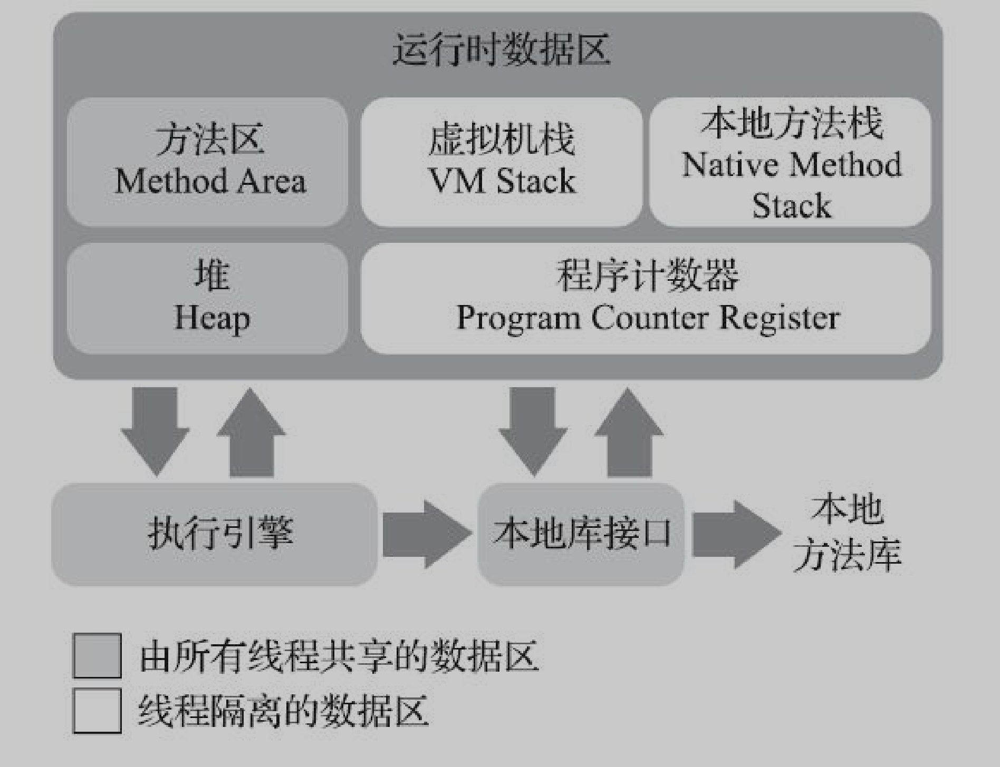
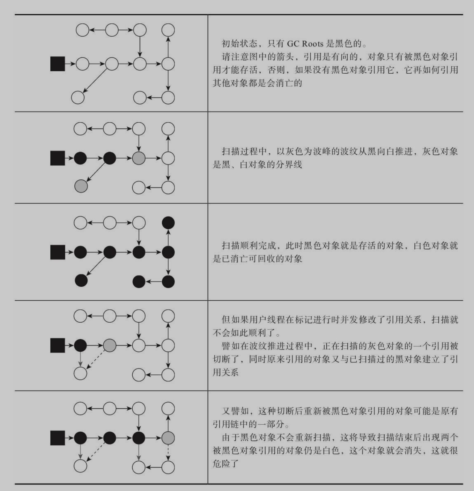
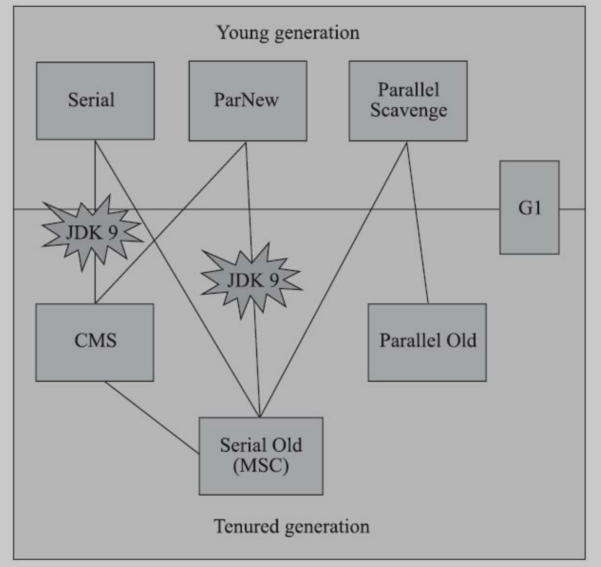
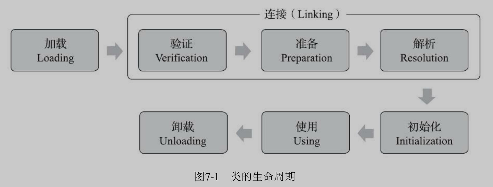
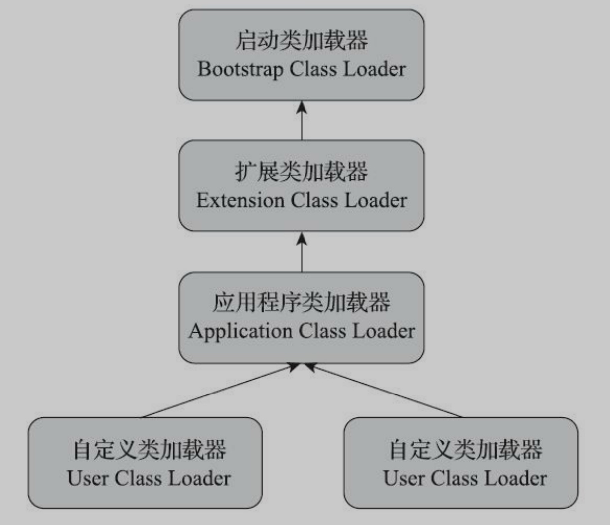
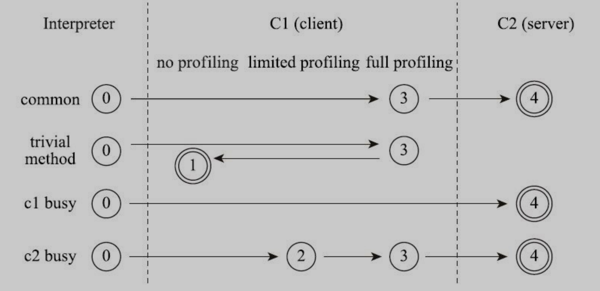
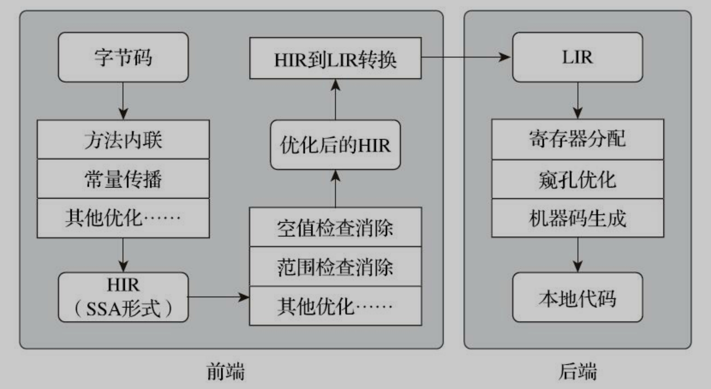
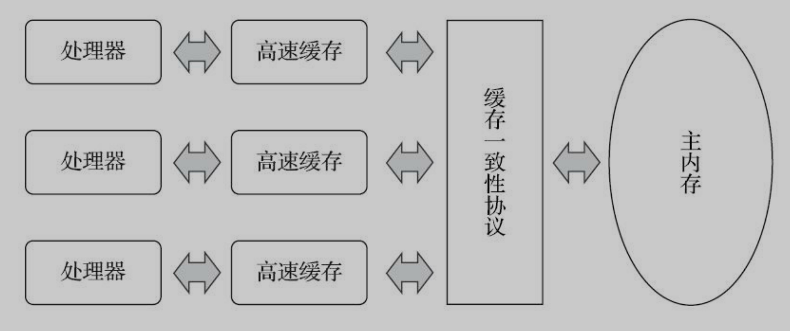
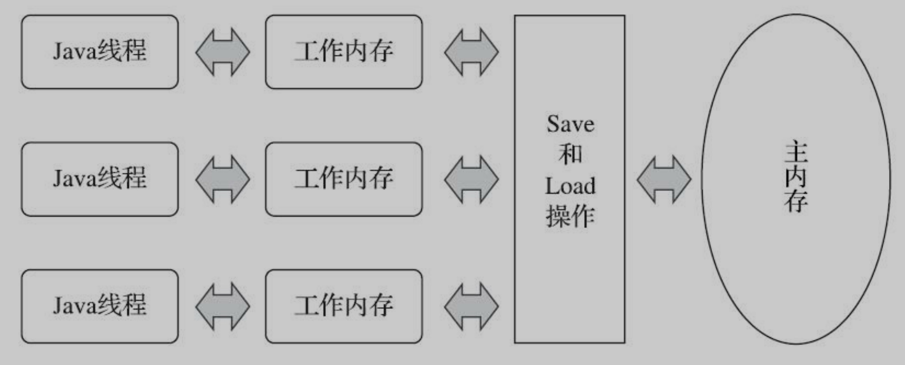

## 虚拟机的种类大概有哪些？
### HotSpot
首当其冲的就是使用最广泛的 `HotSpot` 虚拟机，它最重要的功能就是和它的名字一样，有`热点探测`的功能。
它的原理是通过方法计数器，找到多次调用的方法，和多次循环的方法，然后以方法为单位，进行二次编译成机器码，物理硬件可以直接执行。
还有就是它的准确式的内存管理。以前的虚拟机，都是通过句柄来操作对象的，而HotSpot可以直接识别栈上的地址是不是一个对象的引用。

### Sun Classic
还有`Sun Classic`是Java的第一款虚拟机，能编译一起，到处运行。这是Java一开始的口号。 但是有很多缺点。
性能慢，不支持即时编译，需要进行外挂。

### Mobile/Embedded VM
还有一种就是运行在一些嵌入式设备，老年机上的Java虚拟机。它的特点就是需要的硬件资源少。

还有一些其他公司的虚拟机，各有各的特点。。。


## 实战1：自己编译JDK
```sh
/Users/chengpeng/Library/Java/JavaVirtualMachines/liberica-1.8.0_322/bin/java -version

brew install autoconf
brew install freetype ccache

bash configure --enable-debug --with-jvm-variants=server
```
---
## JVM的内存管理模型是什么样子的？


在java虚拟机中，最重要的两个分区就是堆和栈
### 堆
堆空间就是我们一般放对象的地方，在栈里面放的都是基本数据类型和对象的引用。
堆也是会被垃圾收集的一块内存空间。可以在物理上不连续，但是在逻辑上连续。
通过JVM的版本不同（G1为分界），对堆的分区也有不同。

### 栈（虚拟机栈）
栈是属于线程的，每一个线程在开始的时候，都会同步创建一个栈空间，每一次方法调用的时候，都会创建一个栈帧，放到这个栈里面，方法调用结束的时候，栈帧就会出栈。栈帧是和方法向对应的，里面有：
- 局部变量表，放一些方法里面的局部变量
- 操作数栈，在做运算的时候需要的一种数据结构
- 动态链接
- 方法出口
- 等等

### 本地方法栈
和操作数栈类似，只不过本地方法栈是给一个native方法服务的。

### 程序计数器
程序计数器是`线程隔离`的，每一个线程都有一个程序计数器。我们的程序本质上是一个一个的字节码指令，像`LOP`什么的，我们的程序（线程）就是一条指令一条指令的往下执行，程序计数器就是记录的`当前程序执行的位置`，就是当前命令的`行号`。
因为在多线程 线程切换的时候，会记录下当前执行命令的行号，再当线程回来继续执行的时候。就会按照程序计数器中的行号继续往下执行。

### 方法区
方法区和堆一样，也是所有线程共用的。在逻辑上，它是数据堆空间的一部分，但是实际上是不同的实现。里面主要放一些：
- 类的信息
- 静态变量的信息
- 常量
- 即时编译后的一些缓存的代码

以JDK8为分界，以前有个永久代，来完成现在方法区的工作，几乎不做垃圾收集（除非一些类的卸载）。因为和堆共用空间，可能会导致内存溢出。
所以现在通过元空间来实现方法区。使用本地内存来实现，不会占用堆空间的大小。

### 运行时常量池
它是属于方法区的一部分。主要保存一些类在编译期的常量，还有运行时动态生成的一些常量。

### 其他内存
堆外内存，不被GC，可以通过NIO直接分配堆外内存，通过堆里面的一个引用来操作堆外内存。在一些场景中可以提高效率。

## Java对象的创建过程是什么样子的？
- 通过字节码中的NEW命令来创建对象
- 看类的字面量在常量池中有没有类的引用
- 判断这个类有没有被加载，如果没有的话，执行类加载
- 通过类，来判断对象多需要内存的大小
- 在堆空间中（eden）占用内存空间，有两种方式
    - 指针碰撞（Serial、ParNew等带压缩整理，需要对齐的堆空间，把判断空闲的指针向后移动特定距离）
    - 空闲列表（CMS中，维护了一个表，来判断哪些内存是空闲的）
- 占内存的并发问题
    - CAS（如果发现冲突，重试）
    - 本地线程分配缓冲（TLAB，-XX：+/-UseTLAB配置开启。    每一个线程提前分配一定的堆内存大小，每个线程在自己的缓存中创建对象，如果自己的内存满了，分配新缓存时，使用同步锁）
- 对象初始化为0（在对象体中，实例数据）
- 设置对象（对象头）。比如：来自于那个类，对象的Hash，偏向锁，存活年龄等。
- 再执行构造函数，完成程序员对对象的初始化。

## Java对象的内存布局是什么样子的？
- 对象头
    - MarkWord：Hash，年龄，锁信息，偏向线程ID等
    - 类型指针、（数组长度）
- 实例数据
    - 对象属性字段
    - 对象和方法的引用
- 数据填充
    - 占位，8的整数倍
- 对象访问的两种方式
    - 句柄
    - 直接指针引用

## 实战2：OutOfMemoryError异常
- 堆内存溢出
- 栈空间溢出（深度、内存大小）
- 方法区溢出（永久代、元空间）
- 直接内存溢出

---
## 如何判断对象是垃圾？
### 引用计数法
开辟一块空间来维护对象被引用的个数，如果为0，就表示该对象没有被引用。
优点：简单，判定效率高
缺点：没法解决循环引用的问题
### 可达性分析算法
从GC Root为根节点，往下开始遍历、引用，搜索到的对象都是被引用的对象，其他的就是没有被引用的对象，需要被清理。
GCRoot包括：
- 栈空间（包括虚拟机栈、本地方法栈）
- 方法区（静态变量，常量）
- JVM内部引用（Class对象，常驻异常，空指针，内存溢出的异常，类加载器）
- 被synchronized锁住的对象
- 等等

会有两次标记的过程
没有被GCRoot调用链的对象，先回被标记一次，再做一次筛选，看需不需要执行finalize()方法。如果需要执行，会放到队列里面执行。
执行finalize()方法有时间限制，不会永久的等待。但是在finalize()方法中，可以把当前对象重新给引用上，以逃离被清除的命运。
队列中执行完了之后，会进行第二次标记，其中对象有可能被重新引用上了（把this赋值给了别的对象）
第二次还是被标记上是垃圾的对象，就真的会被执行清除。

### 对方法区的回收
- 字符串常量的回收
- 类的卸载、回收（字节码创建的类）

## Java中引用的类型有哪些？
### 强引用 (Strongly Reference)
一般口中的引用，对象被强引用，就不会被回收
```java
Object o = new Object();
```

### 软引用 （Soft Reference）
还有用，但是非必需的对象。一般GC不会清理，但是内存溢出前会清理。
```java
SoftReference<Object> softReference = new SoftReference<>(new Object());
```

### 弱引用（Weak Reference）
被弱引用关联的对象只 能生存到下一次垃圾收集发生为止.
```java
WeakReference<Object> weakReference = new WeakReference<>(new Object());
```

### 虚引用（Phantom Reference）
不能被访问，没啥用，唯一的用处，就是对象在被回收的时候，得到一个系统通知。
```java
PhantomReference<Object> phantomReference = new PhantomReference<>(new Object(), new ReferenceQueue<>());
```

## 垃圾收集算法有哪些？介绍一下。
### 标记-清除算法
基础GC算法，先标记，后清除。

问题：
- 对象多，垃圾对象多的时候，效率不稳定，需要一个个的清除
- 会产生内存碎片

### 标记-复制算法
把内存分为大小相等的两块，每次只使用一块。每次做完标记之后，把存活的对象（新生代中存活的对象往往都是少数），全部移动到另外一块空白的内存上去，再把之前的这块内存全部清除。

好处：
- 一次性的清除一块区域，效率高
- 每次复制的时候做整理，没有内存碎片
- 实现简单
-
缺点：
- 内存空间利用率低，每次只能用到一半的内存。

### 标记-整理算法
先标记，在进行整理，把存活的对象都整理到一边，再把边界之外的对象一次性全部清理掉。

优点：
- 没有内存碎片
- 执行清理掉效率比较高
-
缺点：
- 移动对象的时候需要更长时间的Stop the world

## HopSpot的垃圾收器是怎么实现的？
1. 通过`OopMap`，在栈、方法区找到引用类型的GCRoot枚举
2. 线程在`安全点`时，才会可能发生GC。比如一些方法调用、循环跳转、异常跳转等
3. 如何在需要GC时，让所有线程都停在安全点上。
    1. `主动式中断`，设置标志位，让线程轮训，自行中断
    2. `抢先式中断`，先全部强制中断，再把没有到安全点点线程，让它运行到安全点。
4. 对于挂起或者sleep中的线程，它可能永远不会走到安全点上，所以对于这样的线程，把它设为`安全区域`，随时可以做GC。
5. 处理跨代的收集->`记忆集`和它的实现 `卡表`
    1. 卡表是记忆集的一种实现
    2. 卡表维护的其他年龄代的一块Page
    3. 如果有其他代的对象引用了当前代，对应卡表的元素变脏
    4. 在GC中，会把变脏的其他代内存对象当成GCRoot来扫描
    5. 在每次赋值操作是，会有个`写屏障`的过程，对赋值操作的AOP，会同时维护卡表元素
6. 可达性分析，如何标记对象。 三色标记法
    - 白色：未被扫描过，如果扫描结束了还是白色，说明这个对象就是垃圾
    - 黑色：不是垃圾，被扫描过，而且它所有引用的对象也被扫描过
    - 灰色：不是垃圾，但是它又被没有扫过的引用
    - 等到没有灰色的时候，表示一次扫描结束。这时候，清除所有白色的垃圾
    - 并发扫描的时候，对象消失的问题（本来应该被标记的对象，没有被标记上。
        - 黑色对象获取了白色对象的引用
        - 灰色对象失去了所有对白色对象的引用
        - 增量更新 and 原始快照
        - 当扫描时，做赋值操作的时候，记录下来，在扫描结束的时候，再扫一次




## 经典的垃圾收集器有哪些？


### Serial收集器（年轻代）
它需要把所有的用户线程全部停下来（Stop the world），然后专心的做垃圾清理。
缺点很明显，就是长时间的STW，影响用户体验，现在已经很少用了。
但是它也有优点，就是简单，单线程，使用的额外内存很少很少。有些场景可能回适用。
### ParNew收集器（年轻代）
他几乎和Serial一样，就是加入了多线程的功能，可以多个线程同时进行GC，但是这样就会增加了线程间切换的开销。
但是它有个优势，就是它可以和CMS搭配使用。在java9之前，这都是官方默认配置。
### Parallel Scavenge收集器（年轻代）
他和ParNew收集器类似，但他有两个重要的特性：
1. 第一点就是它可以控制每次GC时STW的时间，和吞吐量的比率，但是如果配置的过小，它GC的就会更加频繁。
2. 第二点就是，它有个自适应开关，打开了之后，我们就不用配置年轻代的大小了，它会根据监控数据，自动适应。
### Serial Old收集器（老年代）
老年代，单线程，串型收集器， 标记-整理。
主要是为了和Parallel Scavenge收集器搭配使用。  还有个用途，就是做CMS的后备收集器。
### Parallel Old收集器（老年代）
Parallel Scavenge收集器的老年代版本， 标记-整理，注重吞吐量和单次GC时间。和Parallel Scavenge搭配使用。
### CMS收集器
java9之前最经典的收集器，STW的时间非常短。它的特点就是可以GC线程和用户线程的并发。
它在一次GC的过程中共有四个阶段：
1. 找到所有的GCRoot（STW）
2. 并发标记
3. 二次标记（STW）
4. 并发清除
   优点：它只需要很短的时间STW来做一些标记工作，标记-清理算法，快。
   缺点：需要额外的内存，来存放在并发期间的新对象。内存不足会抛异常。会执行Serial Old收集。    需要间隔的执行内存整理，防止内存碎片。
### G1收集器
它是在java9之后主要的收集器，在以后也会慢慢的替换掉CMS。它的内存模型有一个比较大的改变，它是把整个的JVM内存分成一个一个的region来管理。每个region可以有不同的角色，比如edian、surivior、老年代和大对象区域。
然后每次回收都会选择性的清理一部分的region，根据配置，来选择清理效率最高的一些region。
它的GC过程主要分成四步：
1. 初始标记（STW）
   这一步主要是找GCRoot，耗时会比较短，因为会跨区域收集，所以每个region里面都会维护一个记忆集，是用来找到持有该region引用的内存区域。
2. 并发标记
   这一步是和用户线程并发执行了，耗时会比较长。
   会维护两个区域，一个是在此过程中，新new出对象存放的区域，这次GC不会被清理。  还有一个就是在此过程中，指针有变换的对象，通过写屏障，就是对赋值操作的切面。会在下一步最终标记里面，再检查一次。
3. 最终标记（STW）
   这一步就是对在并发标记过程中，指针有变化的对象，再做一次确定操作，这一步也是需要STW的，保证不会把不是垃圾的对象收集掉。
4. 筛选清除（STW）
   这一步的时候，就能确定region里面的垃圾了，也可以计算出清理region所需要的时间，大概，然后对清理的成本和价值做个排序，根据配置的清理时间，确定要清理哪一些region。 再做复制-清除操作，因为涉及到了复制对象，所以需要用户线程是STW的。

相比CMS，它需要更多内存空间来维护一些东西，比如region的管理，每个region都会有一份的卡表（跨区域指针），而CMS只需要在年轻代维护一份卡表就行了。  它的主要优势是它把整个JVM内存化整为零，不会一次性清理全部的区域，而是根据配置，可控的清理一部分region。  还有一点就是，每次清理实际上是标记-复制法，所以不会有内存碎片，而CMS是标记-清除法，会有内存碎片的问题。   目前在大内存的服务器上，G1的性能会更好。

## 低延迟的垃圾收集器有哪些？
### Shenandoah收集器
它不是Oracle官方出的GC，是redhat搞的，所以不受官方的支持，只能在openJDK上使用。
它的内存分布和G1差不多，都是使用region把内存分成一个一个的小块，再进行收集。
它的收集过程
1. GCRoot标记
2. 并发标记
3. 最终标记
4. 并发清理（清理全部是垃圾的region）
5. 并发回收（把region中存活的对象，移到新的region中）
6. 初始引用更新（这里把老对象的地址，和对应新对象的地址找出来，并做成一个Map映射， 短暂的STW）
7. 并发引用更新（按物理顺序扫描，按照映射修改引用地址）
8. 最终引用更新（更改GCTRoot的引用，短暂STW）
9. 最终并发清理（这时候老的region应该都是垃圾对象了，再并发清理掉）

它的特点就是停顿时间很短，基本上大的操作都是并发执行的，但是就是因为是并发，会有很多线程竞争的场景，所以总体吞吐量不大。整体性能一般。

### ZGC
它是目前最先进的一款收集器，参考的是Azul公司的PGC和C4收集器。 它最大的特点，就是在对象在region间复制的过程中，不需要STW，而且复制过去了之后，立马生效，不同再等到全堆扫描更新引用。
它主要的技术是：
- 染色指针（就是在指针上面打Flag，而不用存在对象头，或者单独维护）
- 读屏障（在对象内存寻址的时候，可以重定向）
- 内存多种映射（这是为了解决不同底层硬件，操作系统对染色指针的不支持）
  它的主要GC过程：
1. 标记（初始、并发、最终）
2. 并发准备重分配（扫描所有的region，找到这次需要清理的region）
3. 并发重分配（就是把region里面不是垃圾的对象做复制转移，并在当前region里面，维护一个转发表，这个时候，就可以把老的对象给删了）     如果这个时候有新的寻址过来，通过读屏障，会在转发表里面，找到对象的新地址，并更新引用。
4. 并发重映射（就是扫描所有的对象，把引用全部更新成新的地址，在转发表里面找），因为这一步不需要立刻执行，所有它把这一步合并到下一次GC的标记操作中了。

## 如何选择垃圾收集器？
场景：
1. 桌面程序，占用内存
2. 服务，注重停顿时间
3. 计算密集性服务，吞吐量
4. 老版本的JDK
5. 有充足预算，直接上Azul公司的C4

## 实战3：内存分配与回收策略

---

## JVM提供了哪些监控工具？
- jps [-lv]  查看所有jvm进程
- jstat [-option] pid  查看jvm状态
- jinfo [-option] pid 查看jvm配置信息
- jmap  查看内存信息
    - `jmap -dump:format=b,file=eclipse.bin 3500`
- jstack pid  查看堆栈信息

## 市面上有哪些可视化的工具？
- JConsole
- VisualVM
- ·Eclipse的Memory Analyzer Tool[5]（MAT）

## JVM是怎么调优的？举例说明一下。
#### 大内存大对象的优化
方案：
1. 用Shenandoah、ZGC等可控延迟的GC
2. 使用Full GC 时，控制频率
3. 拆分虚拟机，一个大内存的JVM变成多个小内存的JVM

#### 缓存溢出
因为某些原因，导致缓存一直没有被消除

#### 堆外内存溢出
使用NIO操作文件，可直接只用堆外内存。 需要注意堆外内存大小。

#### 调用shell脚本导致内存溢出
通过Java的Runtime.getRuntime().exec()，这个非常消耗资源，频繁调用，会导致内存溢出。

#### socket链接长时间等待
链接服务慢，导致本机长时间等待，socket链接堆积，导致内存溢出。
可更换链接方式。

#### 数据分析，大批量数据存活
大匹量对象在Eden中存活，在Surivor中来回复制，导致停顿时间长。

#### 某线程到达安全点时间长
某线程使用int使用循环，是不会进入安全点的。导致该线程需要长时间到达安全点，其他线程只能等待。
方案：找到长时间运转的线程，把int->long

## Class文件结构是什么样子的？
1. Magic Number
2. 版本号
3. 常量池（字面量+引用符号）
4. 类描述符、父类、接口列表
5. 字段集合
6. 方法集合
7. 属性集合（类的源文件、方法体）

## 你知道的字节码指令有哪些？
#### 加载、存储指令
- load：从局部变量表 加载 到操作数栈（入栈）
- store：从操作数栈 存储数据到局部变量表（出栈）
- const：加载一个常量到操作数栈（入栈）
#### 运算指令
- 加：add
- 减：sub
- 乘：mul
- 除：div
- 取余：rem
- 取反：neg
- 位移：shl、shr
- 按位与、或：and、or
- 按位异或：xor
- 局部变量自增：inc
- 比较：cmpg、cmpl
#### 对象创建与访问指令
- 创建对象：new
- 创建数组：newarray
- 访问对象属性：getfield、putfield、getstatic、putstatic
- 数组操作：aload、astore
#### 操作数栈管理指令
- 出栈：pop、pop2
- 复制栈顶的值：dup、dup2
- 栈顶两个元素交换位置：swap
#### 控制转移指令
- if
- switch
- goto
#### 方法调用和返回指令
- **invokevirtual**
- invokeinterface
- invokespecial
- **invokedynamic**
#### 异常指令
- athrow
#### 同步指令（synchronized）
- monitor enter
- monitor exit

## Java的类加载过程是什么样子的？


1. 加载（加载字节码）
```
1. 通过全限定类名找到改类的二进制流（字节码）
2. 将字节码流转化成方法区的存储结构
3. 在内存中生成一个Class对象，来作为这个类的访问入口
```
2. 验证（验证字节码格式）
```
对字节码的格式、语义做校验，要是不符合规范的，抛出VerifyException。
```
3. 准备（基础数据类型的准备）
```
为一些静态变量赋值，static修饰的变量，赋成 0 。
但是使用final修饰的常量，直接赋成定义的值。
```
4. 解析（引用类型的解析，找到对应的类，并做一些校验）
```
将符号引用转换成直接引用。
就是将字符串、字面量转换成其他类真正的引用。
如果其他的类还没有加载，就先加载其他的类。
```
5. 初始化（走一些静态语句脚本）
```
JVM会汇总一个clinit方法，里面会包含所有变量的赋值操作，和静态代码块的内容。
然后会对它们按顺序执行。
如果它的父类有clinit方法，会先执行父类的。
```

## 有几种类加载器？双亲委派是什么？


- 启动类加载器（bootstrap）
    - 加载java核心代码（lib目录下），比如rt.jar tools.jar
    - C语言编写，我们没法使用
- 扩展类加载器（extension）
    - 加载java扩展代码，ext目录下
    - Java编写，可以获取到使用
- 应用程序类加载器（application）
    - 加载我们自己编写的代码
    - 一般Class默认的类加载器
- 自定义类加载器
    - 实现 `ClassLoader`接口

#### 双亲委派
当我们得到一个全限定类名，并尝试加载它的时候，会先让当前Classloader的父加载器去加载，如果该类不在父加载器的加载范围，再使用当前加载器加载。
这样的目的是保证一些核心类的安全。一些基础的类，比如Object，只能使用bootstrap加载器加载。
以为在Java中，判断一个类的唯一性，是通过 类加载器+全限定类名 来判断的，如果使用两个类加载器加载Object，会导致程序错乱。
#### 打破双亲委派
1. java1.2以前
2. 热部署、osgi

#### 在java9之后的双亲委派
在java9之后，引入了模块系统，每个模块是隔离的，所以在ApplicationClassLoader和PlatfromClassLoader中，在向上委派之前，会现在其他的module中找一下这个类的归属，如果属于别的module，就让别的module的classloader加载。

## Java运行时候的栈帧是什么样子的？
- 局部变量表（变量保存）
    - 它主要存储在当前作用域中的一些局部变量，存储单元是变量槽，0号变量槽是this，其他的变量（方法参数，定义的变量）从1开始往后。
    - 变量槽可以复用，但是不会主动擦除数据。
- 操作数栈（函数、方法的参数传递）
    - 栈结构，用来做运算和方法调用
- 动态链接（找调用方法的入口）
    - 在多态的情况下，只有在运行时才能知道，到底是调用的哪个类的方法，所以要保存一个动态链接。
- 方法返回地址（当前方法的出口）

## Java运行时，方法调用的过程是什么样子的？
方法调用主要分为两种，静态的和动态的。
- invoke字节码命令
- 静态分配
    - 在编译期间就能够去定需要调用的是哪个方法
    - 在一些static方法调用，无继承的（finial修饰）方法调用
- 动态分配
    - 在运行期间才能够确定，到底调用的是哪个方法
    - 典型的就是多态，在运行的时候，才能确定调用的是哪个子类对象
- 在方法区中，虚拟机会对每个类维护一个虚方法表，来记录它调用地址的入口，如果是继承的方法且没有重写，就会指向父类的对应方法入口。
- 接口同理（接口方法表）
- 没有别final修饰的方法，都是虚方法

## Java的动态语言类型支持是什么样子的？
通过`invokedynamic`字节码命令实现。
在别的动态类型语言里面，类似JavaScript、Grvooy，通过`var`来定义对象，这个时候就不能确定引用的类型，所以在实际运行时方法调用的时候，需要找到真正执行方法，就有一个lookup的过程。

## 实战4：掌控方法分派规则

## 字节码解释执行的过程是什么样子的？
我们编写的Java源代码，本质上就是一堆字符串，计算机肯定不认识，所以我们把这段字符串交给JVM编译，编译的结果有两种：
一种是字节码，JVM认识，物理机不认识，只能通过JVM解释执行。
还有一种就是CPU的指令集，汇编，本质上就是0101，物理机能直接执行。

在JVM的解释执行字节码的过程中，是通过操作数栈进行指令执行的，它是基于内存的，所以速度理论上会慢一点，但是它不会依赖物理机器，可移植。 而物理机执行的话，是基于寄存器的，速度会很快，但是不同架构的CPU的寄存器和指令集都是不同的，就没有可移植性。

## 你了解的字节码生成技术是什么样子的？

## 实战5：自己动手实现远程执行功能

## Java编译的流程是什么样子的？
Java的编译主要依靠javac工具来执行的，他的任务就是把java源代码，编译成 .class的字节码。
主要通过`JavaCompiler`类来实现的。
有4个过程：
- 准备过程
    - 准备插入式注解处理器（`initProcessAnnotations`）
- 语法解析 and 填充符号表 -> 生成抽象语法树
    - 语法、词法解析。（`parseFiles`）
        - 有点像ES中的分词，生成抽象语法树（AST）。
        - 后续的操作都基于这个抽象语法树了。
        - 有插件可以查看。
    - 填充符号表。 产生符号地址和符号信息内容（`enterTrees`）
- 注解处理器的处理过程。 （`processAnnotations`）
    - 通过注解，在编译期间对抽象语法树做出处理。 著名的案例就是Lombok。
- 分析语法树 and 字节码生成（`compile2()`）
    - 标注检查分析（静态）（`attribute()`）
    - 控制流检查分析（动态）（`flow()`）
    - 解语法糖（`desugar()`）
    - 字节码生成（`generate()`）

## 实战6：插入式注解处理器

## 后端编译的过程是什么样子的？
后端编译就是java的字节码编译成机器码的过程。在机器上直接跑机器码，速度和性能就会更快。
后端编译就是即时编译，是HotSpot虚拟机有的一个主要的功能，其他虚拟机有的也有。
它主要的作用，就是在运行期间，对代码的热度，进行统计分析，针对的是方法级别和循环体级别，然后把热点的字节码编译成机器码，让计算机原生之行。

热点统计方式主要有两种：
1、采样。  定时在所有栈的顶部采集栈帧，统计方法调用的次数。
2、方法计数器。 每个方法、代码块，维护一个调用计数器。到达一定的阈值，就会成为热点代码，会被即时编译期异步的编译成为原生的机器码。

在HotSpot虚拟机中，主要有三种即时编译器，C1、C2和Java10才出来的Graal。 其中Graal的作用是C2的升级版。

在JVM中，使用的是分层编译的方式。
第0层，就是纯解释执行
第1层，是使用C1编译器，简单快速的编译，并不做统计。
第2层，使用C1编译器编译，并做有限的性能监控。
第3层，使用C1编译器，并开启全部都性能监控
第4层，使用C2编译器，做激进的性能优化


## 编译的优化方法有哪些？
- 方法内联（多态方法内联缓存）
- 逃逸分析（看这个对象有没有超过方法的范围（栈帧），有没有超过线程的范围（方法栈））
    - 栈上分配（把对象直接在栈上创建，不在堆内存创建）
    - 标量替换（不new出对象，用几个局部变量来代替）
    - 同步消除（如果有锁，而这个对象并没有超出线程的范围，就把锁的过程给优化掉）
- 无效代码消除
- 公共子表达式消除（在一个表达式中，如果有重复计算的地方，给他做合并消除，即只需要计算一次）
- 代数化简（数学操作）
- 数组边界检查、隐式异常处理、自动装箱消除

#### 客户端编译器  C1
在整体的编译过程一共有几个阶段。

第一个就是从 `字节码`  编译成  `HIR`（高级的中间表示编码，与硬件指令集无关）
这个时候，会做一些优化。如：`方法内联`、`常数传播`

第二阶段就是 对  `HIR`编码做优化
会做一些 `范围检查消除`、`空值检查消除`等优化

第三阶段就是 把 `HIR`  编译成  `LIR`（低等级的中间表示，与硬件指令集有关）

最后一阶段，就是在`LIR`上做`线性算法扫描`，`分配寄存器`，做`窥孔`（Peephole）优化， 最后生成`机器码`。


#### 服务端编译器  C2
服务端编译器的优化会更加的激进。

无用代码消除（Dead Code Elimination）、
循环展开 （Loop Unrolling）、
循环表达式外提（Loop Expression Hoisting）、
消除公共子表达式（Common Subexpression Elimination）、
常量传播（Constant Propagation）、
基本块重排序（Basic Block Reordering）等

范围检查消除（Range Check Elimination）、
空值检查消除（Null Check Elimination）

如守护内联（Guarded Inlining）、
分支频率预测 （Branch Frequency Prediction）

## 提前编译 和 即时编译 各有什么优缺点？
提前编译的优点：
1. 独立的资源，在程序运行之前编译，可以享受大量的资源。
2. 一开始运行时的程序的速度就会非常快，不会有预热的过程。
   及时编译的优点：
1. 实时监控，编译需要编译的代码，并且按层级编译，最高效的使用资源。
2. 可以执行激进的编译优化策略，也是根据性能监控。
3. 动态链接时优化，在运行时，可以确定动态链接库，可以做一些优化，比如方法内联。

## 实战6：深入理解Graal编译器
字节码 -> 理想图 -> 优化 -> 机器码

## Java内存模型是什么样子的？
首先要从计算机的发展说起，摩尔定律慢慢的失效，硬件发展到了一个瓶颈，而在这种情况下，并行化的发展越来越被看重。 所以就CPU的核心数就越来越多。
而有一个客观问题的存在，CPU的速度实在太快了，跟内存的IO不是一个数量级的，我们为了能更加的压榨CPU的性能，就在CPU的每个核心中设立了高速缓存，一般是三层。
而这样就会出现一个问题，在多个核心同时对主内存中的数据做操作的时候，会先把内存中的数据缓存一份到自己的高速缓存中，再进行操作。这样就会有了一个数据不一致的并发的问题。  解决这个问题的方法，就是设定一个缓存一致性协议。


而JAVA在这样的基础上，对CPU、高速缓存、主内存这样的硬件结构的基础上，做了一个抽象。就成了JMM（JAVA内存模型）



## volatile关键字有什么用？
1. 保证变量的可见性
    - 线程1和线程2，同时操作主内存里面的一个数据。
    - 两个线程都会把数据缓存到自己的工作内存中（高速缓存或寄存器）
    - 如果线程1操作了这个数据，会立刻把更新过后的数据同步到主内存之中
    - 线程2在操作这个数据之前，会先从主内存中拉取最新的数据，再进行操作。
2. 阻止指令重排序
    - CPU在执行程序的时候，不一定会按照我们代码编写的顺序执行
    - CPU为了优化，在编译成汇编语言的时候，会对程序进行各种优化
    - 在赋值操作的时候，顺序的变化可能会导致意想不到的问题
    - volatile会防止指令的重排序，会添加一个`lock add`的指令，内存屏障
    - 指令重排的意义在于，CPU把不同的指令，同时分配给不同的电路单元，以提高性能

## Java的多线程是怎么实现的？
在主流的操作系统中，线程一般有三种实现方式：
1. 内核线程，操作系统自己实现
2. 用户线程，应用程序实现
3. 混合模式，内核线程+用户线程  在一个核心线程上，再扩展N个用户线程

JAVA中，主流的JVM都是使用的内核线程，具体的调度由操作系统控制。
在GO中，主要使用的是用户线程

核心线程的重要的性能消耗是操作系统在内核态与用户态之间的转换，但是它的优点就是实现起来方便，调操作系统的接口就行了， 上下文的保持工作也是由操作系统实现。  
而用户线程的有点就是实现起来非常复杂，线程的调度，线程上下文的保持都需要代码实现。而它的优点就是运行效率更高一些。
在新版本的JAVA中，也引入的用户线程的实现，fiber，纤程/协程。 JAVA可以同时支持核心线程和用户线程

## Java中线程安全是怎么保证的？
1. synchronized关键字
2. concurrent包， ReentrantLock
3. 分布式锁  redis/zk

## Java中有哪些锁优化？
- 自旋锁 CAS 忙循环，不会进入线程阻塞  JVM监控子系统还会推算忙循环的次数
- 锁消除  如果JVM发现没有共享内存变量，即不需要锁，就会把锁给去了
- 锁粗化  如果检测到一连串的锁，比如StringBuffer连续append，会粗化成一个锁
- 轻量级锁   由对象头的MarkWord中的标志位 标记。
    - 如果对象的标志位为`01`，表示未上锁，线程会通过CSA把标志位改成`00`，并持有这个锁对象
    - 如果这时候有另外的线程来抢占这个锁，会把锁升级成重量级锁，标志位`10`
- 偏向锁  在无锁状态下的优化
    - 在一个线程占用了一个锁对象，又释放了，这时候这个对象是无锁的状态，还会把偏向模式设成1，并记录这个线程的ID
    - 如果这个线程再次获取锁，且在无并发竞争的情况下，不需要上锁了


